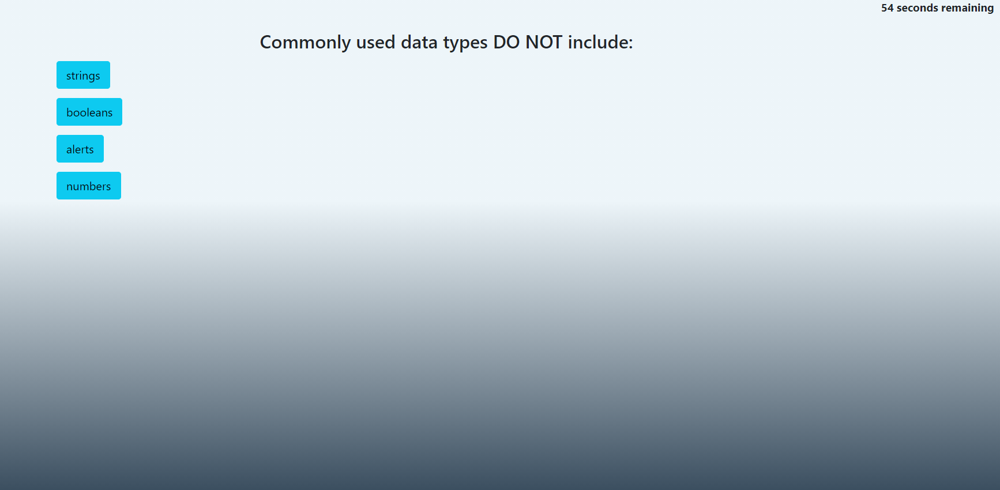

# Code Quiz
## Homework Week 4: Code Quiz
===

## Description
This project consists of a code quiz.  When the quiz begins, elements are revealed to show dynamically updating HTML elements manipulated entirely through JavaScript.  The buttons check for correct answer input and reveal whether an answer is correct or incorrect.  In the event of an incorrect answer, 10 seconds are subtracted from the overall timer.  Once the quiz is completed, either through running out of time or finishing all the questions, a final screen is revealed giving the user the option to repeat the quiz or, if done in time, enter their initials into the high score section.  The high score sections are stored locally and recalled on page load.

## Screenshot
Here you can find a mockup screenshot of the webpage, displaying a random string already generated in the field:

---

## URL
Web page can be located at [Gitpages](https://mrg105.github.io/Code-Quiz/ "Code Quiz")

## Repo
Repository can be located at [Github](https://github.com/MrG105/Code-Quiz "Github")

## Contact
Javascript code and Repo updated by Gabriel Gutierrez.  [email](poo328@my.utsa.edu "email")